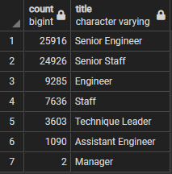
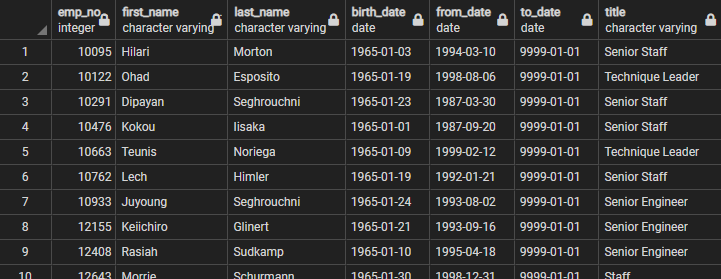
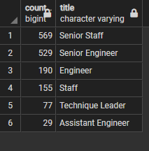
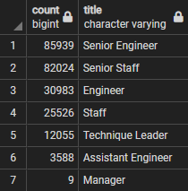
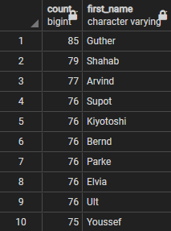

# **Pewlett Hackard Analysis**

## **Overview**
This analysis will help future leaders at Pewlett Hackard understand what is the future of their workforce could look like. Specifically, what portion of their employees are nearing retirement age and in which departments or with specific titles. Proactively planning for this is a key question the company should consider when thinking about hiring new talent and understanding where workforce needs will be most apparent.

## **Results**
### **Status of Retirement PH Employees**
Senior Engineer will have the most employees in retirement age with 25,916 followed by Senior Staff with 24,926. Managers are the least likely to be impacted 

### **Mentorship Elligibility**
The full list is captured in the database with the relevant information needed.

Yet a more helpful view shows this same mentorship list segmented by job title to match the retirement eligibile summary above.

### **Key Findings**
- There are 1,549 empolyees on the mentorhip elligibility list with 72,458 employees in retirement age.
- Senior Engineers and Senior Staff will have the highest volume of retirements in the years ahead.
- 
## **Summary**
### **How many roles will need to be filled as the 'silver tsunami' begins to make an impact?**
72,458 employees will be retiring in the next handful of years.

### **Are there enough qualifitied employees to mentor next generation of Pewlett hackard employees?**
There are 1,549 employees that are elligible to mentors to the remaining employees and therefore lessen the blow of senior members of the company leaving in the near future. The only exception is Managers who have no current employees that fit into the mentorship qualities that were screened for.

### **What portion of each department is eligible for retirmentment?**
Given the following are retirement age:

The number of total employees by job title is:

As a result it is apparent that Managers were least likely to be impacted by silver tsunami (22% of all managers) and Senior Staff were most likely to be impacted (30.39% of all senior staff). At a macro level, all job titles could expect between 28% and 31% of their employees to be in the retirement age range.

### **HR is creating personalized badges for retiring employees, which first names are most common amongst those eligible to retire?**
Understanding how many different badges will need to be made (only first names included on badge) will help HR budget correctly for this expense in the future.

